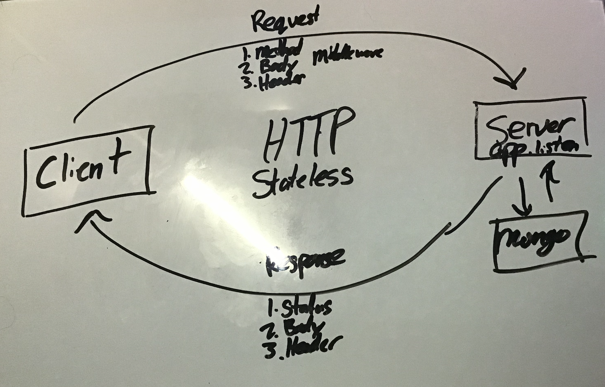

#  basic-auth

---

## Author: Elijah Prom Version: 1.0.0

---

## Overview

A basic API server that runs tests to see if the server works the ability to add a record, get all records, get one record, update a record, and delete a record

---

## Architecture

-NodeJS -npm -JS

---

[Heroku](https://ep-basic-auth.herokuapp.com/)

[GitHub](https://github.com/S2Mackinley/basic-auth)

[Pull Request](https://github.com/S2Mackinley/basic-auth/pull/2)

